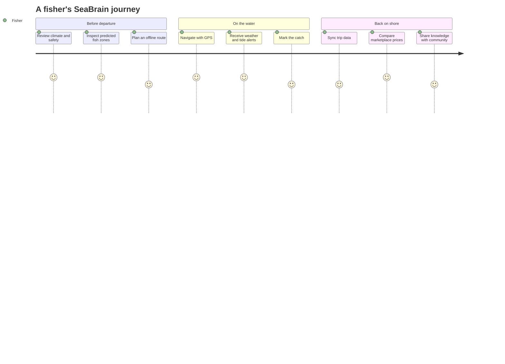
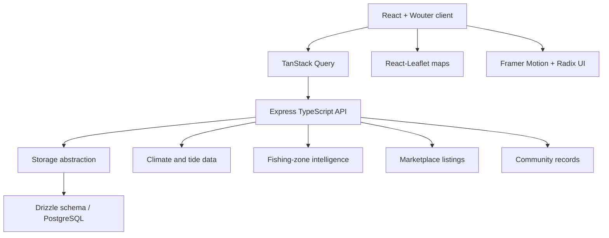

<div align="center">

# SEABRAIN

## OCEAN INTELLIGENCE FOR COASTAL FISHING COMMUNITIES


**Prediction, navigation, climate awareness, market intelligence, and community support—from shore to sea.**

[Launch SeaBrain](https://seabrain.netlify.app) · [Deployment notes](DEPLOYMENT.md) · [Feature log](NEW_FEATURES_SUMMARY.md)

</div>

## Captain's view

This is a genuine capture of the deployed SeaBrain home experience.

[](https://seabrain.netlify.app)

## The voyage



## Bridge instruments

| Instrument | What it surfaces |
|---|---|
| Fish Zones | Mapped areas, species, abundance probability, and harbors |
| Climate | Weather, depth bands, tides, UV, forecast, moon phase, and safety cues |
| Mark Catch | Trip and catch recording for later review |
| Marketplace | Fish listings, location and price filters, direct seller contact |
| SEA-Assist | English, Telugu, and Tamil fishing guidance |
| Contact / SOS | Safety-oriented contacts and emergency access |
| Community | Fisher updates, experiences, images, and practical knowledge |
| Dashboard | Income, participation, monitoring, and operational summaries |

## Signal architecture



## Set sail locally

Prerequisites: Node.js 18+ and npm.

```bash
git clone https://github.com/QizarBilal/SeaBrain.git
cd SeaBrain
npm install
cp .env.example .env
npm run dev
```

Open `http://localhost:5000`.

```bash
npm run check
npm run build
npm start
```

## Hull layout

```text
client/src/
├── components/      navigation, hero, chatbot, reusable interface
├── pages/           home, dashboard, map, climate, market, catch, SOS, community
├── hooks/           reusable client behavior
├── lib/             data and UI utilities
└── App.tsx          route composition
server/
├── index.ts         Express bootstrap
├── routes.ts        service endpoints
├── storage.ts       persistence boundary
└── vite.ts          development integration
shared/schema.ts     database and shared types
```

## Data-confidence compass

Several interface statistics and predictions are product claims represented by the application. A production maritime tool should label each value as live, simulated, estimated, or historical; disclose its source and update time; and attach uncertainty to prediction output. Safety warnings must never depend on a single provider or replace official maritime advisories.

## Safety boundary

SeaBrain is an informational prototype, not certified marine-navigation, distress, weather-warning, or life-safety equipment. Anyone operating at sea should use official forecasts, coast-guard guidance, approved navigation hardware, radios, emergency beacons, and locally required safety procedures. Offline capability must be proven on-device before it is promised operationally.

## Sea trials

- Test every route at mobile, tablet, and desktop widths.
- Verify map zones, harbor markers, popups, and layer controls.
- Exercise light/dark mode and all three assistant languages.
- Simulate loss and recovery of connectivity during a trip.
- Confirm catch records survive refresh and synchronize safely.
- Validate marketplace searches, empty states, and seller contact actions.
- Exercise SOS access with one hand and under poor network conditions.
- Audit contrast, motion reduction, touch targets, and screen-reader labels.

## Responsible ocean intelligence

Prediction systems can affect livelihoods and ecosystems. Future iterations should avoid exposing sensitive fishing locations without consent, monitor ecological impact, provide transparent model limitations, support sustainable-catch guidance, and prevent marketplace features from encouraging illegal or protected-species trade.

## License

Released under the [MIT License](LICENSE).

<div align="center">

`OBSERVE · PREDICT · NAVIGATE · LAND SAFELY`

Supporting informed coastal decisions and UN SDG 14: Life Below Water.

</div>
